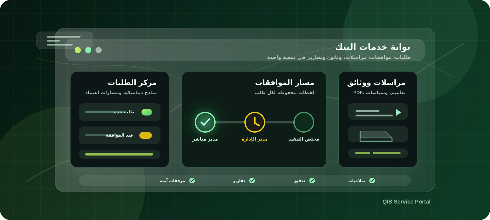

# QIB Service Portal

نظام بوابة خدمات داخلي لبنك القطيبي الإسلامي، يدعم العربية واتجاه RTL، ويغطي دورة العمل كاملة: الطلبات، الموافقات، التنفيذ، المراسلات، مكتبة الوثائق، التقارير، الإعدادات، التدقيق، الصحة التشغيلية، وأدوات قاعدة البيانات.

يوجد حالياً مساران للتشغيل:

- **FastAPI الحالي**: الخلفية الأصلية على `/api/v1`.
- **ASP.NET Core المستقل**: خلفية جديدة تعمل بالتوازي على `/api/dotnet/v1` مع قاعدة بيانات PostgreSQL منفصلة، ولا تستبدل النظام الحالي إلا بعد اختبار كامل.

## التثبيت السريع

### تشغيل النظام الحالي FastAPI

على macOS أو Linux:

```bash
bash scripts/run-local.sh
```

أو تشغيل الخلفية فقط:

```bash
bash scripts/start-fastapi-api.sh
```

المنافذ الافتراضية:

- الواجهة: `http://localhost:5173`
- FastAPI: `http://127.0.0.1:8000`
- API Base: `http://127.0.0.1:8000/api/v1`

### تشغيل نسخة .NET المستقلة

تشغيل الواجهة مع ASP.NET Core API المستقل:

```bash
bash scripts/start-frontend-dotnet.sh
```

هذا الأمر يقوم بتشغيل:

- ASP.NET Core API عبر Docker.
- PostgreSQL مستقل لنسخة .NET.
- الواجهة على منفذ مستقل.

المنافذ الافتراضية:

- الواجهة: `http://localhost:5174`
- .NET API: `http://localhost:8088`
- .NET API Base: `http://localhost:8088/api/dotnet/v1`
- Swagger: `http://localhost:8088/api/dotnet/v1/docs`
- PostgreSQL المستقل: `localhost:55432`

لتشغيل .NET API فقط:

```bash
bash scripts/start-dotnet-api.sh
```

على Windows PowerShell يمكن تشغيل .NET عبر Docker مباشرة:

```powershell
cd Qib.ServicePortal.Api
docker compose up -d --build
```

ثم تشغيل الواجهة وربطها بـ .NET:

```powershell
cd frontend
npm install
$env:VITE_API_BASE_URL="http://localhost:8088/api/dotnet/v1"
npm run dev -- --mode dotnet --host 0.0.0.0 --port 5174
```

للتثبيت التقليدي لنسخة FastAPI على Windows:

```powershell
powershell -ExecutionPolicy Bypass -File scripts/install-local.ps1
```

للمزيد من التفاصيل راجع [INSTALL.md](INSTALL.md).

## التقنيات المستخدمة

### الواجهة الأمامية

- React
- TypeScript
- Vite
- Tailwind CSS
- React Router
- Fetch / Axios
- Lucide Icons
- دعم الوضع الليلي والنهاري
- دعم ربط الواجهة إما بـ FastAPI أو .NET عبر `VITE_API_BASE_URL`

### الخلفية الحالية FastAPI

- FastAPI
- Uvicorn
- SQLAlchemy
- Pydantic
- JWT Authentication
- Passlib / bcrypt
- python-multipart
- ReportLab
- arabic-reshaper و python-bidi لدعم العربية في PDF
- OpenPyXL لاستيراد وتصدير Excel
- SQLite للتطوير المحلي أو PostgreSQL للنشر

### الخلفية المستقلة ASP.NET Core

- ASP.NET Core Web API
- .NET 8 LTS
- Entity Framework Core
- PostgreSQL
- JWT Authentication و Refresh Tokens
- Permission-Based Authorization
- FluentValidation
- Serilog
- Health Checks
- Swagger / OpenAPI
- Quartz للمهام المجدولة
- QuestPDF لتوليد PDF
- Docker Compose لتشغيل API وقاعدة البيانات بشكل مستقل

## قاعدة البيانات

### FastAPI

- يدعم SQLite للتطوير المحلي.
- يدعم PostgreSQL عبر Docker أو بيئات النشر.
- المسار الافتراضي للتطوير المحلي: `backend/qib_local.db`.

### ASP.NET Core

- يستخدم PostgreSQL مستقل حتى لا يؤثر على قاعدة النظام الحالية.
- Docker Compose ينشئ قاعدة:
  - Database: `qib_service_portal_dotnet`
  - User: `qib_dotnet`
  - Port: `55432`
- لا يتم ترحيل بيانات الإنتاج تلقائياً إلى .NET.
- أي Cutover لاحق يجب أن يتم بعد اختبار السيناريوهات والترحيل المخطط.

## الخصائص الرئيسية

### تسجيل الدخول والأمان

- تسجيل الدخول بالبريد الإلكتروني أو الرقم الوظيفي حسب الإعداد.
- JWT لحماية الجلسات.
- Refresh Tokens في نسخة .NET.
- تغيير كلمة المرور.
- قفل الحساب بعد محاولات فاشلة.
- محاولات الدخول وسجلات الجلسات.
- صلاحيات حسب الدور والمستخدم.
- سجل تدقيق للعمليات الحساسة.

### المستخدمون والصلاحيات

- إضافة وتعديل وتعطيل المستخدمين.
- إعادة تعيين كلمة المرور.
- ربط المستخدم بإدارة.
- ربط الموظف بمدير مباشر.
- تحديد نوع العلاقة الوظيفية.
- ربط مختص التنفيذ بقسم مختص.
- إدارة الأدوار والصلاحيات.
- صلاحيات افتراضية للموظف: الطلبات، الموافقات عند وجود تكليف، المراسلات إذا كانت مفعلة، ومكتبة الوثائق.

### الإدارات والأقسام المختصة

- إدارة الإدارات.
- تحديد مدير الإدارة.
- إدارة الأقسام المختصة.
- ربط القسم المختص بإدارة.
- تحديد مدير القسم المختص ومختصي التنفيذ.
- استخدام هذه الروابط في التوجيه ومسارات الموافقات.

### إدارة الطلبات

- أنواع طلبات ديناميكية.
- إصدارات لأنواع الطلبات.
- حقول ديناميكية لكل نوع طلب.
- مسارات موافقات مخصصة.
- قواعد مرفقات لكل نوع طلب.
- SLA وأولوية افتراضية.
- توجيه للقسم المختص.
- نشر النسخ الجديدة بدون التأثير على الطلبات القائمة.

### الطلبات

- إنشاء طلب جديد من أنواع الطلبات الفعالة فقط.
- عرض الحقول الديناميكية من النسخة الفعالة.
- حفظ Snapshot للحقول ومسار الموافقات عند الإرسال.
- رفع المرفقات حسب قواعد نوع الطلب.
- إلغاء، إرجاع للتعديل، إعادة إرسال، وإعادة فتح حسب الصلاحيات والإعدادات.
- PDF للطلب باللغة العربية واتجاه RTL.

### الموافقات والتنفيذ

- مركز موافقات وتنفيذ.
- عرض الطلبات بانتظار موافقتي.
- عرض طلبات التنفيذ حسب القسم المختص.
- موافقة، رفض، إرجاع للتعديل، تنفيذ، وإغلاق.
- إخفاء أزرار القرار عند عدم امتلاك المستخدم صلاحية على المرحلة الحالية.
- عرض سجل الموافقات مع من قام بالإجراء والتاريخ والملاحظات.
- استخدام Workflow Snapshot للطلبات القائمة.

### المراسلات الداخلية

- صندوق وارد ومرسل ومؤرشف وغير مقروء.
- إرسال ورد وأرشفة وقراءة/غير مقروء.
- ربط المراسلات بالطلبات.
- تصنيفات السرية.
- أنواع رسائل قابلة للإدارة من الإعدادات.
- إعدادات مراسلات تنعكس على شاشة المراسلات والطلبات.
- محرر نصوص يدعم العربية ويلصق النص كنص نظيف بدون تنسيق خارجي.

### المراسلات الرسمية

- قوالب ترويسة رسمية.
- معاينة PDF للخطاب الرسمي.
- توليد PDF رسمي للرسالة.
- خيار توقيع المستخدم داخل الخطاب الرسمي حسب إعدادات المراسلات.
- تضمين الرسائل الرسمية في PDF الطلب عند تفعيل الإعداد.
- حذف فكرة الأختام من النظام.

### مكتبة الوثائق

- مكتبة وثائق PDF فقط.
- تصنيفات وثائق.
- رفع وعرض وتحميل الوثائق حسب الصلاحيات.
- إصدارات للوثائق.
- إقرار بالاطلاع.
- صلاحيات عرض وتحميل وطباعة وإدارة.
- سجل وصول وتدقيق.

### التقارير والإحصائيات

- تقارير الطلبات والموافقات والمراسلات والتدقيق.
- تصدير Excel و PDF.
- لوحة إحصائيات تشغيلية قابلة للتخصيص بالـ Widgets.
- مؤشرات حسب صلاحيات المستخدم ونطاقه.

### إعدادات النظام

- الإعدادات العامة.
- إعدادات الأمان.
- إعدادات المرفقات.
- إعدادات المراسلات.
- إعدادات الذكاء الاصطناعي.
- إعدادات قاعدة البيانات.
- إعدادات الصحة التشغيلية.
- إعدادات التحديثات.
- صفحة حول النظام.

### الصحة التشغيلية وقاعدة البيانات

- فحص صحة النظام.
- فحص قاعدة البيانات.
- سجلات الصحة والتنبيهات.
- نسخ احتياطي واستعادة.
- سجل عمليات قاعدة البيانات.
- العمليات الخطرة محمية بإعداد `EnableDangerousDatabaseOperations`.

## وثائق النظام

- [وثيقة النظام الكاملة](docs/QIB_SERVICE_PORTAL_SYSTEM_DOCUMENTATION.md)
- [مخطط قاعدة البيانات](docs/database-schema.md)
- [دليل مجلدات النظام والتثبيت على Windows](docs/WINDOWS_INSTALLATION_AND_STRUCTURE_AR.md)
- [توثيق ASP.NET Core Backend](docs/ASP_NET_BACKEND_AR.md)
- [دليل نشر Windows Server لنسخة .NET](docs/WINDOWS_SERVER_DEPLOYMENT_DOTNET_AR.md)

## هيكل المشروع

```text
backend/
  app/
    api/v1/        واجهات FastAPI
    core/          الإعدادات والأمان
    db/            الاتصال بقاعدة البيانات وتهيئة البيانات
    models/        نماذج SQLAlchemy
    schemas/       مخططات Pydantic
    services/      خدمات سير العمل والتدقيق
    utils/         أدوات مساعدة

Qib.ServicePortal.Api/
  Controllers/     Controllers الخاصة بـ ASP.NET Core
  Application/     DTOs والخدمات والواجهات والتحقق
  Domain/          الكيانات والأنواع الأساسية
  Infrastructure/  EF Core والملفات وPDF والمهام
  Common/          Middleware والصلاحيات والأدوات المشتركة
  Program.cs
  docker-compose.yml

frontend/
  src/
    components/    مكونات الواجهة
    pages/         صفحات النظام
    lib/           الاتصال بالـ API وتطبيع استجابات FastAPI/.NET

docs/
  assets/
  database-schema.md
```

## التشغيل المحلي بالتفصيل

### FastAPI مع الواجهة

```bash
bash scripts/run-local.sh
```

أو يدوياً:

```bash
cd backend
python -m venv .venv
source .venv/bin/activate
pip install -r requirements.txt
uvicorn app.main:app --host 0.0.0.0 --port 8000 --reload
```

ثم:

```bash
cd frontend
npm install
VITE_API_BASE_URL=http://127.0.0.1:8000/api/v1 npm run dev -- --port 5173
```

مثال ملف بيئة FastAPI:

```env
DATABASE_URL=sqlite:///./qib_local.db
SECRET_KEY=local-development-secret
CORS_ORIGINS=http://localhost:5173,http://127.0.0.1:5173
SEED_ADMIN_EMAIL=admin@qib.internal-bank.qa
SEED_ADMIN_PASSWORD=Admin@12345
```

### .NET API المستقل مع الواجهة

```bash
bash scripts/start-frontend-dotnet.sh
```

أو يدوياً:

```bash
cd Qib.ServicePortal.Api
docker compose up -d --build
```

ثم:

```bash
cd frontend
npm install
VITE_API_BASE_URL=http://localhost:8088/api/dotnet/v1 npm run dev -- --mode dotnet --host 0.0.0.0 --port 5174
```

أهم متغيرات .NET داخل Docker:

```env
ConnectionStrings__DefaultConnection=Host=qib-dotnet-postgres;Port=5432;Database=qib_service_portal_dotnet;Username=qib_dotnet;Password=qib_dotnet_dev_password
Jwt__Issuer=Qib.ServicePortal.DotNet
Jwt__Audience=Qib.ServicePortal
Jwt__Secret=CHANGE_ME_TO_A_LONG_RANDOM_SECRET_AT_LEAST_32_CHARS
SeedAdmin__Email=admin@qib.internal-bank.qa
SeedAdmin__Password=ChangeMe@12345
Storage__UploadsPath=/data/uploads
Storage__BackupsPath=/data/backups
Swagger__Enabled=true
```

## التشغيل عبر Docker

### FastAPI الحالي

```bash
docker compose up --build -d
```

### ASP.NET Core المستقل

```bash
cd Qib.ServicePortal.Api
docker compose up -d --build
```

إيقاف نسخة .NET:

```bash
cd Qib.ServicePortal.Api
docker compose down
```

متابعة سجلات .NET:

```bash
cd Qib.ServicePortal.Api
docker compose logs -f qib-dotnet-api
```

## الحسابات الافتراضية

### FastAPI

```text
Email: admin@qib.internal-bank.qa
Password: Admin@12345
```

### ASP.NET Core

```text
Email: admin@qib.internal-bank.qa
Password: ChangeMe@12345
```

يجب تغيير كلمات المرور الافتراضية قبل أي تشغيل رسمي.

لإعادة ضبط كلمة مرور مدير النظام في نسخة .NET:

```bash
DOTNET_ADMIN_IDENTIFIER=admin@qib.internal-bank.qa DOTNET_ADMIN_PASSWORD='NewPassword' bash scripts/reset-dotnet-admin-password.sh
```

## أهم واجهات API

### FastAPI

- Base URL: `http://127.0.0.1:8000/api/v1`
- Docs: `http://127.0.0.1:8000/docs`
- Health: `http://127.0.0.1:8000/health`

أمثلة:

- `POST /api/v1/auth/login`
- `GET /api/v1/auth/me`
- `GET /api/v1/requests`
- `POST /api/v1/requests`
- `POST /api/v1/requests/{request_id}/approval`
- `GET /api/v1/messages/inbox`
- `GET /api/v1/settings/request-management/overview`

### ASP.NET Core

- Base URL: `http://localhost:8088/api/dotnet/v1`
- Swagger: `http://localhost:8088/api/dotnet/v1/docs`
- Health: `http://localhost:8088/api/dotnet/v1/health/live`

أمثلة:

- `POST /api/dotnet/v1/auth/login`
- `POST /api/dotnet/v1/auth/refresh-token`
- `GET /api/dotnet/v1/auth/me`
- `GET /api/dotnet/v1/users`
- `GET /api/dotnet/v1/request-types`
- `GET /api/dotnet/v1/requests`
- `GET /api/dotnet/v1/approvals`
- `GET /api/dotnet/v1/messages/inbox`
- `GET /api/dotnet/v1/documents/categories`
- `GET /api/dotnet/v1/reports/summary`

## أوامر مفيدة

بناء الواجهة:

```bash
cd frontend
npm run build
```

فحص FastAPI:

```bash
cd backend
python -m compileall app
```

فحص .NET:

```bash
cd Qib.ServicePortal.Api
dotnet build
```

تشغيل اختبارات السيناريوهات:

```bash
bash scripts/run-scenario-tests.sh
```

عرض حالة Docker لنسخة .NET:

```bash
cd Qib.ServicePortal.Api
docker compose ps
```

## ملاحظات مهمة قبل الإنتاج

- نسخة .NET تعمل بالتوازي ولا يجب توصيلها بقاعدة الإنتاج الحالية قبل خطة ترحيل واختبار كاملة.
- غيّر كل القيم الافتراضية: كلمات المرور، `SECRET_KEY`، و`Jwt__Secret`.
- اضبط `CORS_ORIGINS` أو `Cors__Origins` حسب عنوان الواجهة الرسمي.
- فعّل HTTPS عبر Nginx أو Reverse Proxy.
- اضبط مسارات المرفقات والنسخ الاحتياطية على تخزين دائم.
- احتفظ بنسخ احتياطية مجدولة من قاعدة البيانات والمرفقات.
- لا تفعّل `EnableDangerousDatabaseOperations` إلا بعد أخذ نسخة احتياطية ومراجعة خطة التنفيذ.
- راجع صلاحيات الشاشات والصلاحيات الإجرائية قبل فتح النظام للمستخدمين.
- اختبر سيناريوهات الطلبات والموافقات والمراسلات والوثائق والتقارير قبل الإنتاج.

## ملاحظات أمنية

- لا تستخدم كلمات مرور افتراضية في الإنتاج.
- لا تمنح صلاحيات مدير النظام إلا للمخولين.
- لا تعرض مسارات الملفات الحقيقية للمستخدمين.
- اجعل تحميل الملفات عبر API محمية فقط.
- استخدم فحص فيروسات فعلي للملفات في بيئة الإنتاج.
- راقب سجلات التدقيق وسجلات الصحة التشغيلية بشكل دوري.
